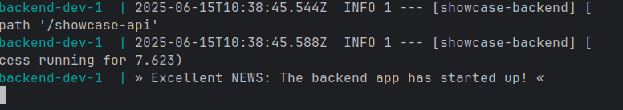

# ✨ Showcase-App Overview ✨

## Table of Contents

- [🤔 Introduction](#-introduction)
- [👾Tech Stack](#-tech-stack)
- [📋 Requirements](#-requirements)
- [🛠️ Project Setup and Configuration ](#-project-setup-and-configuration)
- [🧑‍🔧🏃 Build and Run the App ](#-build-and-run-the-app)
- [🧑‍💻 Testing the App Using the Endpoints](#-testing-the-app-using-the-endpoints)
- [📚 References](#-references)


---
## 🤔 Introduction

### 📘 Project Overview
This app is a simple showcase of a containerized REST API Java backend using Spring Boot, a relational database and modern development practices like automated testing. 🧑‍🎨🙌

### 🎯 Features

- Create, read, update, and delete (very! 😏) simple [AppInfo](src/main/java/com/showcase/backend/domain/AppInfo.java) objects in the database! 🤯
- RESTful endpoints
- Examples of automated integration- and unit tests
- Containerized setup

### 📦 Example: Saving an AppInfo Object

To save an object, send a JSON like this to the [POST endpoint](#-create-entity-):
```
{
    "version": "0.0.1",
    "description": "A bare skeleton of an app."
}
```

### ⚙️ How It Works

1. The [REST controller](src/main/java/com/showcase/backend/controller/AppInfoController.java) receives the JSON.
2. It converts the JSON to an AppInfo object.
3. The object is passed to a [service](src/main/java/com/showcase/backend/service/AppInfoService.java).
4. The services has access to a [repository](src/main/java/com/showcase/backend/repository/AppInfoRepository.java) that can persist the object with an auto generated, sequential ID in the database.


> 💡 **Side Note:**  
> For a sketch of a different approach: Namely, autogenerated UUID's (useful for distributed systems) see the
[Note](src/main/java/com/showcase/backend/domain/Note.java) class and the
[script to ensure UUIDv7 generation](src/main/java/com/showcase/backend/domain/Note.java) on the database level.

### ⚡ Quick Summary

All other operations work in a similar way.  
As recommended entry points to the code, check out the [Docker Compose file](compose.yaml), the [AppInfo](src/main/java/com/showcase/backend/domain/AppInfo.java) class or the [ITAppInfoControllerSpec](src/test/groovy/com/showcase/backend/integration/controller/ITAppInfoControllerSpec.groovy) integration test.

---

## 👾 Tech Stack

- **Build & Dependency Management**
   - ⚙️ [Gradle 8.14](https://docs.gradle.org/8.14/release-notes.html): Build automation and dependency management

- **Languages**
   - ☕ [Java 21.0.7](https://wiki.openjdk.org/display/JDKUpdates/JDK+21u): Primary backend language
   - 🐴 [Groovy 3.0.21](https://groovy-lang.org/changelogs/changelog-3.0.21.html): Scripting and testing
   - 🐚 [Shell Script](https://en.wikipedia.org/wiki/Shell_script): Automation scripts for setup and utilities

- **Frameworks & Libraries**
   - 🌱 [Spring Boot 3.5.0](https://spring.io/blog/2025/05/22/spring-boot-3-5-0-available-now): Application framework
   - 🧛‍♂️ [Spock 2.4-M6](https://github.com/spockframework/spock): Testing framework
   - 🐘 [Hibernate 8.0.1](https://hibernate.org/validator/releases/8.0/): Object-Relation Mapping for data persistence
   - ✍️ [Lombok 1.18.38](https://projectlombok.org/changelog): Boilerplate code reduction

- **Containerization & Orchestration**
   - 🐳 [Docker 28.2.2](https://docs.docker.com/engine/release-notes/): Containerization platform
   - 📦 [Docker Compose 2.36.2](https://docs.docker.com/compose/release-notes/): Multi-container orchestration

- **Database**
   - 🐬 [MariaDB 11.4.7](https://mariadb.org/): Relational database

---

## 📋 Requirements

To build and run the project you need the following software installed and available in your systems PATH.

- Docker 28.2.2, build e6534b4
- Docker Compose 2.36.2
- MariaDB 11.4.7
- Java SDK 21.0.7 
- IDE of your choice for Java/Groovy development

---

## 🛠️ Project Setup and Configuration

### 1. 🌳 Clone the Repository
- Clone this repository to your local machine and open it in your favorite IDE.

### 2. 📁 Configure Environment and Application Files

**2.1. Create Environment Variables File**
- Copy [template.env](template.env) to `.env` in the project root directory.
- Edit `.env` to set your local credentials and configuration.

**2.2. Create Default Spring Profile**
- Copy [template-application.properties](src/main/resources/templates/template-application.properties) to `src/main/resources/application.properties`.
- Update properties as needed.

**2.3. Create Debug Spring Profile**
- Copy [debug-application.properties](src/main/resources/templates/template-application-debug.properties) to  
`src/main/resources/templates/template-application-debug.properties`.
- Update properties as needed.

**2.4. Create Integration Test Spring Profile**
- Copy [template-application-integration.properties](src/test/resources/templates/template-application-integration.properties) to `src/test/resources/application-integration.properties`.
- Adjust settings for integration testing.

> 💡 *For all templates: Follow the instructions inside each file to complete your configuration.*

### 3. 🗄️ Set Up Local MariaDB for Integration Tests
- Ensure MariaDB is running on port `7306` (see [🐬 How-To: Change MariaDB Port](knowledge/MariaDB-Help.md#4-how-to-change-mariadb-port)).
- If using a different port, update the value in `application-integration.properties` (e.g., `jdbc:mariadb://localhost:{yourPort}`).

### 4. 💾 Set Up Persistent Storage for Database Containers
- Follow [🐬 How-To: Setup custom data directory](knowledge/MariaDB-Help.md#2-how-to-setup-custom-data-directory) in [🐬 MariaDB-Help](knowledge/MariaDB-Help.md) to configure a local Docker volume for data persistence.

### 5. 🐳 Docker & Docker Compose
- Make sure Docker and Docker Compose are installed and running.
- If you encounter issues (😬) you can consult [🐳 Docker-Help](knowledge/Docker-Help.md) (which also includes links to maintenance scripts).

### 6. 🔌 Make the build script executable

**6.1. Goto the directory of the [create-and-run-app.sh](scripts/create-and-run-app.sh) script**   
- `cd scripts/`

**6.2. Make it executable with the terminal cmd:**  
- `chmod +x create-and-run-app.sh`


>  💡 Side note:  Inside the script are some additional config options and deactivated
   commands for troubleshooting (but highly recommended to leave those untouched! 😉).

---
## 🧑‍🔧🏃 Build and Run the App

### 1. 🚀 Run the [Build Script](scripts/create-and-run-app.sh)

- To perform a **normal build** run: `./create-and-run-app.sh`
- To perform a **complete clean build** run: `./create-and-run-app.sh clean`

### 2. 📊 View Test Reports (Optional)

- Gradle generates an HTML report for integration and unit tests.
- View the [report](build/reports/tests/test/index.html) here: 👉 [`build/reports/tests/test/index.html`](build/reports/tests/test/index.html)

### 3. ✅ Successful Build

After executing the script this is what you should see if everything went well:



---

## 🧑‍💻 Testing the App Using the Endpoints

The following section lists the commands for the command line tool [curl](https://curl.se/) to test the app.  
But you could also use a more visual tool like [Postman](https://www.postman.com/) if you like. 

### **📨 Create Entity**  

This will create the entity you send in the database.  

- POST url: http://localhost:9007/showcase-api/appinfo  

- Verbose curl cmd with response:    
`curl -v -i -X POST http://localhost:9007/showcase-api/appinfo -H "Content-Type: application/json" -d '{"version": "0.0.1", "description": "A bare skeleton of an app."}'`

### **📤📄 Retrieve Entity by ID**  

This will send you the entity you specified by its id from the database.    

- GET url: http://localhost:9007/showcase-api/appinfo/{id}

- Verbose curl cmd with response (for ID=1):  
`curl -v -i -X GET http://localhost:9007/showcase-api/appinfo/1`

### **📤📑 Retrieve all Entities as List**

This will send you a list of ALL entities from the database.

- GET url: http://localhost:9007/showcase-api/appinfo

- Verbose curl cmd with response:  
`curl -v -i -X GET http://localhost:9007/showcase-api/appinfo`

### **📝 Update Entity**  

This will update the entity you specified by its id in the database with the entity you send.    

- PUT url: http://localhost:9007/showcase-api/appinfo/{id}

- Verbose curl cmd with response (for ID=1):  
`curl -v -i -X PUT http://localhost:9007/showcase-api/appinfo/1 -H "Content-Type: application/json" -d '{"version": "0.0.2", "description": "A skeleton of an app that wastes up to 250mb!"}'`

### **🗑 Delete Entity**  

This will delete the entity you specified by its id in the database.

- DELETE url: http://localhost:9007/showcase-api/appinfo/1

- Verbose curl cmd with response (for ID=1):  
`curl -v -i -X DELETE http://localhost:9007/showcase-api/appinfo/1`


## 📚 References

- This manual was heavily inspired by the guidelines and best practise examples of: https://github.com/matiassingers/awesome-readme?tab=readme-ov-file